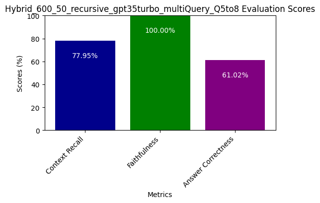

# RAG System Optimization

## Objective
Develop a Retrieval-Augmented Generation (RAG) system, benchmark its performance, and implement an optimization to improve the results.

## Project Structure

    RAG-System-Optimization/
    ├── api/
    │   ├── chunking/                  # Implementation for sentence, character, semantic and recursive
    │   ├── database/                  # Postgres db implementation
    │   ├── factory/                   # Factory methods to initialize components based on the configuration
    │   ├── generator/                 # Langchain Pipeline of multi_query, rag_fusion, decomposition, raptor, no_translation
    │   ├── main/                      # FastAPI starting point
    │   ├── models/                    # Postgres db table models
    │   ├── retriever/                 # Qdrant, Weviate and Chroma Retriever Implementation
    │   └── schemas/                   # A class schema for message history and query
    ├── notebooks/
    │   ├── rag_systems.ipynb          # Simple RAG system implementation Experiment
    │   └── ragas_evaluation.ipynb     # Notebook where all experimentaions can be found
    ├── data/
    │   ├── Hybrid_600_50_recursive_gpt35turbo_ragFusion_Q5to11.csv     # CSV file for ragas evaluation test outputs
    │   ├── Dense_600_50_recursive_gpt35turbo_noTranslation_Q5to8.csv   # With naming of used hyper parameters
    │   └── ...
    │── screenshots/
    │   ├── image.png                  # Relevant images and ragas test plots
    │   └── ...
    ├── scripts/
    │   ├── rag_system.py              # RAG system implementation using Langchain
    │   ├── ragas_evaluation.py        # Ragas evaluation script using API calls 
    │   ├── testset_generator.py       # Script to generate a synthetic testset usig ragas
    │   └── helpers.py
    ├── tests/
    │   ├── test_data.py
    │   ├── test_models.py
    │   └── test_evaluation.py
    ├── config.yaml                    # Configuration files to manage and swap hyperparameters
    ├── pyproject.toml                 # Poetry requirements file
    ├── .gitignore
    └── README.md

## Setup
1. Install Poetry - If Not Available

```sh
curl -sSL https://install.python-poetry.org | python3 -
```

2. Clone the repository

```sh
git clone https://github.com/dev-abuke/RAG-System-Optimization.git
```

2. Navigate to project directory

```sh
cd RAG-System-Optimization
```

3. Install dependencies

```sh
   poetry install
```

4. Run The Backend API

```sh
   uvicorn api.main:app --reload
```

4. Query the Backend API

- Post Request at `http://127.0.0.1:8000/qa/{any_save_name_to_save_conversation}`

```sh
   {
      "query": "Who decided to give one of her kidneys?"
   }
```


- Returns a response with answer and context


## Development

- Use the Jupyter notebooks in the `notebooks/` directory for exploration and prototyping.
- Implement core functionality in the `api/` directory.
- Add unit tests in the `tests/` directory.
- Use `config.yaml` to manage project settings and hyper parameters.

## Evaluation

The system's performance is evaluated using the following metrics

- Context recall
   - **Rationale:** We chose this metrics for two reasons one it is one of a component wise testing that we wanted to focus on i.e context and to gauge the performance of our retriever
- Answer Correctness
   - **Rationale:**  This metrics will be gauging the accuracy of the generated answer when compared to the ground truth. we chose this because it could potentialy test our RAG end-to-end performance
- Faithfulness
   - **Rationale:** This metrics gauges the factual consistency of the generated answer against the given context hence idealy testing our generation or llm component.

Refer to the [ragas_evaluation.ipynb](notebooks/ragas_evaluation.ipynb) notebook for detailed results and analysis.

## Optimization Techniques

This project explores various optimization techniques, including

1. Advanced retrieval from Qdrant and Chroma
2. Hybrid search methods using Weaviate
3. Query expansions such as multi_query, rag_fusion, decomposition and hyde
4. Chunking strategies like sentence, character, semantic and recursive chunkings
5. Prompt engineering

## Result 1

 

As we have shown in our Implementation of config file we had multiple hyperparams we are looking at thus it was imperative we name our tests to keep track of the params we change and to save the files for later use.
The above Image shows that our first test was run with a Dense vector store, a recursive chunking of size 600 and 50 overlap and also as we have implemented different query translations for our initial test we did not use any i.e "noTranslation" in our naming
also "Q5to8" implies that we were using the test datasets from index 5 to 8

#### Result 1 Interpretation

We found that context recall was rather performing poorly meaning more than half of our ground truths  statement can not be attributed to the context retrieved hence we need to look into our retrieval mechanism and optimize for that.

## Result 2

 

For our next improvement we changed the chunk size to 256 and overlap to 16 and got the above result which is almost similar to our previous one

#### Result 2 Interpretation

**Verdict:** Same as Result 1, we also need to optimize for the context

## Result 3


on our 3rd RAGAS test in optimization with chunk size 900 and overlap 50, using recursive chunker and without any query translation. The result showed a significant improvement in context recall, attributing to a higher chunk size. although this result seemed promising, while we carefully investigated each question and answer [Output of Result 3](data/Qdrant_Dense_900_50_recursive_gpt35turbo_noTranslation_Q5to11.csv) we can see that the higher context recall is attributed to the the simple questions, the reasoning and multi context question are recalled relatively lower suggesting this RAG pipeline potentialy might fail for more complex questions and we needed to optimize our RAG rurther

### Result 3 Interpretation

It can be seen that on bench marking that this RAG pipeline have improvements but might perform rather poorly when queries are more complex

**Verdict:** Further optimization in retrival mechanisms or use Query Translation to get better results

### Result 4


We used a simple multi query to generate 3 question and get their unique union in context retrival that could potentialy capture the context when retieved, and we can see that recall has been relatively better and answer correctness has also improved while also a multi context questions were ranked higher but faithfulness was ranked lower however we achieved higher than average overall rank

#### Result 4 Interpretation

We saw that even though we are using 3 question against 12 question and ground truth generated syntheticaly using RAGAS but we saw that some of the ground truths are a relatively week against the context 

**Verdict:** Refine the ground truths ideally or change the question and Ground Truths (seemed to be only one question with that problem) and implement other retrival mechanism

### Result 5



We Run the RAGAs evaluation using a Hybrid Database that was implemented using Weviate which showed a really good results as can be see we have a significal increase in faithfulness and context recall was also one of the better performing one but since we did not change the faulty ground truth that had a significant effect on context recall thus we must change that also, answer correctness is on the top 2.

#### Result 5 Interpretation

We can see that context recall faired better in context recall being in top 2 

**Verdict:** Change the chunking mechanisms such as semantic and other query mechanisms with hybrid retrival (as this significantly increased the performance)

### Result 6


#### Result 6 Interpretation

It shows that the context recall has incresed and answer correctness has decreased by 3% but the overall benchmark has faired best shooting up to 85% we previously did run the evaluation with multi query and compared it to "noTranslation" their is a slight increse in answer correctness while using "noTranslation", below is our evaluation using the same pipeline but with multi query


**Verdict:**  Optimize for answer correctness using reranking methods

### Result 7


We used a Rag Fusion Optimization (this eval is run on 6 different questions to gauge the changes in performance) as we will have a reranking (RRF) method implemented in RAG fusion, and we used hybrid as it gives one of the top performing evaluations in our RAG pipeline.

#### Result 7 Interpretation

There is a clear win in answer correctness from our previous evaluations but faithfulness has redused by 25
% and context recall by around 18% however these evals account for the errors in sythetic dataset and some ground truths needed refinement and human annotation on that grounds this eval could fair better if refined and used different embeddings, LLMs and optimize for the  trade offs between dense and keyword (sparse) searchs like BM25 i.e adjusting alpha variable in weaviate while also experimenting with interquantile, percentile and standard deviation chunking.

**Verdict:**  Optimize for answer correctness using reranking methods


## Contributing

Contributions to improve the system are welcome. Please follow these steps

1. Fork the repository
2. Create a new branch (`git checkout -b feature/your-feature`)
3. Make your changes and commit them (`git commit -am 'Add new feature'`)
4. Push to the branch (`git push origin feature/your-feature`)
5. Create a new Pull Request

## License

This project is licensed under the MIT License - see the [LICENSE](LICENSE) file for details.

## Acknowledgments

- Rizzbuzz AI for the challenge, GPT_API_Key and guidance

## Contact

For any queries, please open an issue on this repository or contact [Abubeker Shamil](hello@abubekershamil.com).
